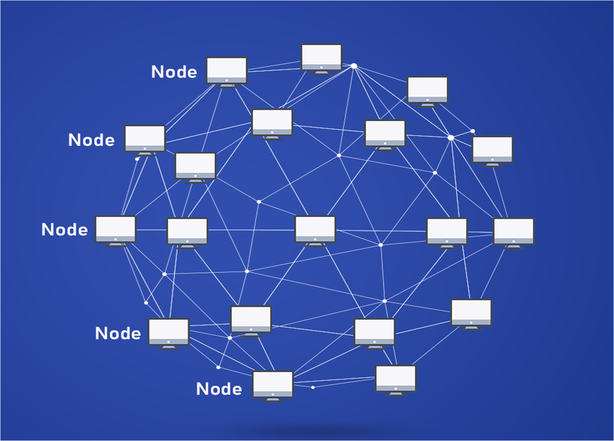
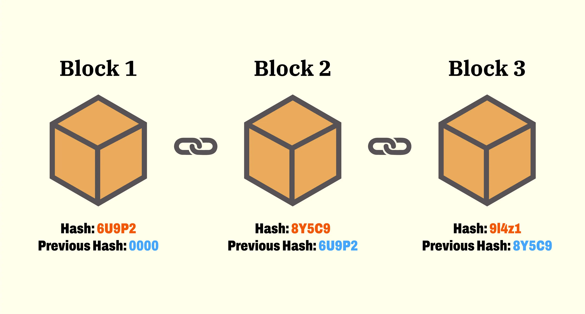

<h1 style="font-weight: 700"> Блокчейн </h1>

## 🤔Что такое Блокчейн простыми словами ##
Представьте себе большую цифровую книгу учета (бухгалтерскую книгу), которую ведут не в одной компании, а одновременно на тысячах компьютеров по всему миру. Это и есть блокчейн.

Простая аналогия: Если вы представите себе общий Google Документ, который каждый может **просматривать** и в который можно **добавлять** новые строки, но никто не может **изменить** или **удалить** уже существующие, то вы близки к пониманию.

В слове Blockchain два составляющих — *Block* (Блок) и *Chain* (Цепь). «Блок» — это запись о нескольких действиях (например, переводах денег). «Цепь» — это связь этих блоков между собой в хронологическом порядке. Каждый новый блок содержит «отпечаток» (хэш) предыдущего. Если кто-то попытается изменить информацию в старом блоке, это сразу станет заметно, так как нарушится вся цепочка. Это делает систему очень надежной и прозрачной.
!!! note
    Блокчейн — вид распределенного реестра, который представляет собой выстроенную по определенным правилам последовательную цепочку, которая формируется из блоков транзакций. При этом каждый последующий блок данной структуры содержит информацию о предыдущем блоке, таким образом, в целом цепочка хранит всю историю совершенных транзакций.

## 🌐Основной прицип блокчейна: Децентрализованность

Традиционные системы (как банк или государственный реестр) — централизованные. Есть один главный сервер или орган, который всем управляет и хранит все данные. Если его взломать, отключить или он выйдет из строя — вся система перестанет работать.

Блокчейн — децентрализованный. У этой цифровой книги нет одного хозяина. Ее полные копии хранятся и обновляются одновременно на тысячах независимых компьютеров по всему миру. Блокчейн сеть на основе архитектуры одноранговой P2P (Peer-to-Peer) сети, которая работает поверх TCP/IP, то есть работает на прикладном уровне модели OSI.

+ В клиент-серверной архитектуре (классический интернет): ваш браузер (клиент) обращается к серверу Google, чтобы получить информацию. Все завязано на одном центральном пункте.
+ В P2P-архитектуре все участники (узлы) равны и соединяются напрямую друг с другом. Нет главного сервера. Каждый узел одновременно является и клиентом, и сервером.

Преимущества архитектуры:

+ Устойчивость: Чтобы «сломать» сеть, нужно выключить все компьютеры одновременно, что невозможно.
+ Отсутствие единой точки отказа: Если один или даже несколько компьютеров выйдут из строя, сеть продолжит работу.
+ Прозрачность и доверие: Все видят все операции, и никто не может тайно их подделать. Доверие создается не посредником (банком), а математикой и криптографией.

## 👥Из кого состоит сеть блокчейна? (Ноды, Майнеры)

Главными участниками сети выступают ноды (пользователи). Нода — это любой компьютер, подключенный к блокчейн-сети. Это основа основ, инфраструктура, на которой всё держится. Они обеспечивают безопасность сети, проверяют подписи в транзакциях, убеждаются в отсутствии двойных трат, проверяют блоки и хранят историю транзакций(блокчейн). 

У нодов есть пара криптографических ключей: **Приватный ключ**(держится в секрете) и **Публичный ключ**(известен всем в сети, ваше идентификатор). С помощью Приватного ключа можно создавать цифровую подпись, которая подтверждает, что транзакция была отправлена именно владельцем.

!!! note
    Криптографические ключи — это фундаментальный механизм безопасности в блокчейне, который обеспечивает владение активами и защиту транзакций.

Как это работает в блокчейне:

+ Новый узел подключается к сети, находя хотя бы несколько других узлов.
+ Когда один узел создает или получает новую информацию (например, транзакцию или блок), он рассылает ее всем своим "соседям". Те, в свою очередь, рассылают ее своим соседям, и так информация распространяется по всей сети за секунды.
+ Если информацию, которую получает узел, неверная, то нод отвергает её и не рассылает дальше.

Виды нодов:

+ Полные ноды (Full Nodes): Хранят полную копию блокчейна от самого первого блока до текущего момента. Проверяют и валидируют каждый новый блок и все транзакции по строгим правилам консенсуса. Автономно верифицируют всю историю транзакций, не доверяя третьим сторонам.Распространяют информацию — ретранслируют валидные данные другим узлам
+ Легкие ноды(Light Nodes): Хранят только заголовки блоков (легковесная версия). Запрашивают информацию о конкретных транзакциях при необходимости. Идеальны для мобильных кошельков и приложений с ограниченными ресурсами
+ Майнеры/Валидаторы — это специализированные участники, которые создают новые блоки через процесс, называемый майнингом.

## 🔑Открытый и закрытый ключ
Открытый и закрытый ключ — это пара криптографических ключей, связанные асиметричным шифрованием.
!!! note
    Криптографические ключи — это
    последовательность данных, используемая в криптографии для защиты информации: шифрования, расшифровки, проверки электронных подписей и аутентификации. Они являются основой кибербезопасности и обеспечивают конфиденциальность и целостность данных. Существуют два основных типа: симметричные (используют один ключ для шифрования и расшифровки) и асимметричные (используют пару открытого и закрытого ключей). 
Приватный ключ представляет из себя 256-битное случайное число, отображается как 64-символьная шестизначная строчка. Пример: *E9873D79C6D87D...*

Публичный ключ генерируется из закрытого ключа через эллиптическую криптографию (ECDSA). Каждому приватному ключу должен соответсвовать единственный публичный.

+ С помощью Приватного ключа можно создавать цифровую подпись, которая подтверждает, что транзакция была отправлена именно владельцем. 
+ С помощью Публичного ключа можно подтвердить подлинность подписи(проверить, что подпись была создана именно владельцем приватного ключа)

Как это работает:

## ✅Как принимают новый блок? (Майнинг, Механизм Консенсуса)
В блокчейн каждый блок состоит из двух частей — **заголовка** и **списка транзакций**.
!!! note
    Хеш (хеш-сумма) — это строка фиксированной длины, которая получается путем преобразования данных произвольного размера с помощью специальной хеш-функции. Этот процесс называется хешированием, а результат — это уникальный идентификатор, который используется для проверки целостности данных или в качестве ключа для поиска в хеш-таблицах. Хеш нельзя восстановить до исходных данных(хеш-функция необратима), а даже малейшее изменение входных данных приведет к совершенно новому хешу.
    В блокчейне используется хеш-функция SHA-256, то есть функция преобразуетв 256-битную строку.
Заголовок состоит из:

1. Хеша предыдущего блока.
2. Времени создания(временной метки).
3. Случайного числа Nonce.
4. Хеша всех транзакций(все транзакции попарно хешируются, пока не получится один единственный хеш).
5. Другие параметры: В зависимости от блокчейна, могут включаться дополнительные данные, например, сложность майнинга.
6. Хеш текущего блока(хеш всех остальных данных в заголовке(1-5) ).

Все блоки связаны в именно в цепочку, потому что каждый хеш нового блока = хеш-функция(хеш предыдущего блока). Блоки нельзя просто так переставить местами, так это нарушит их взаимосвязь через хеши.

Для того чтобы принять новый блок, независимым участники распределенной сети нужно договориться об едином состоянии данных, то есть прийти к общему согласию(консенсусу). Консенсус обеспечивает целостность и работоспособность сети блокчейн, помогает достичь согласия между ее участниками. В отличие от протокола, который устанавливает нормы обмена данными между участниками сети, механизм консенсуса определяет то, как они приходят к согласию по актуальному состоянию этих данных.

Механизм консенсуса в блокчейне необходим для защиты сети от конфликтов, двойных трат, а также других видов нарушений.

Механизмы консенсуса бывают различными, функционируют они на основе разных принципов. В Bitcoin таким является Proof of Work(Доказательство работы). В этом механизме майнеру, чтобы получить возможность сформировать блок, ему нужно провести определенную вычислительную работу.

Работой майнером является формирование блока(проверка на отсутствие двойных трат)подбор случайного числа Nonce, под условия сети. Майнеры подбирают число и вычисляют с ним хеш. Когда найдется майнер, который первый найдет правильное nonce, такое что хеш будет соответсвовать определенным условиям, то он сможет распространить его версию нового блока. Доказательством работы будет выступать nonce. В награду майнер получает все комиссии с тразакций, а также новые созданные монеты

## 🏗️Применение блокчейн вне сферы криптовалют
Блокчейн — это технология доверия, поэтому ее используют везде, где нужна прозрачность, безопасность и отсутствие посредников.

+ Цепочки поставок (Supply Chain)🚢 — Можно отследить путь продукта от фермы до полки в магазине. Покупатель может отсканировать QR-код и убедиться в подлинности товара (например, рыбы, кофе, роскошных часов). Пример: американская сеть магазинов Walmart
+ Управление цифровыми правами (Digital Identity)🆔 — Хранение цифровых паспортов, дипломов, медицинских карт. Вы сами контролируете свои данные и даете к ним доступ кому хотите. Пример: British Airways. Авиакомпания тестирует сервис VChain Verification Service на блокчейне, который проверяет подлинность проездных документов пассажиров, не передавая их личные данные третьим сторонам, что ускоряет процесс регистрации
+ Голосование🗳️ — Прозрачные и надежные выборы, где нельзя подделать голоса, и каждый может проверить результат.
+ Недвижимость и юриспруденция🏠 — Умные контракты могут автоматизировать куплю-продажу недвижимости, регистрацию прав собственности, исполнение завещаний.
+ Игры и метавселенные🎮 — Игровые предметы (NFT) действительно принадлежат игроку, а не компании-разработчику. Их можно продавать и покупать.

🇷🇺 Российские компании и блокчейн

Российский бизнес и государственные структуры активно исследуют и внедряют блокчейн-решения для оптимизации процессов и повышения прозрачности.

💰 Финансы и банковское дело

+ СберБанк - разработал платформу «СберБлокчейн» на базе Hyperledger Fabric, использует для выпуска цифровых банковских гарантий и проведения сделок репо
+ Альфа-Банк - внедрял блокчейн для автоматизации процесса выдачи банковских гарантий, что ускоряет получение гарантий клиентами
+ ВТБ - проводил эксперименты с блокчейн-платформой для межбанковских расчетов и документарных операций

🚚 Логистика и ритейл

+ X5 Group («Пятерочка», «Перекресток») - использует блокчейн-платформу «Финтренд» для автоматизации финансирования поставок, позволяя поставщикам получать оплату сразу после приемки товара
+ «Вайлдберриз» - применяет блокчейн для защиты авторских прав брендов и борьбы с контрафактом через создание реестра подлинных товаров
+ Группа «М.Видео-Эльдорадо» - тестировала блокчейн для отслеживания цепочек поставок бытовой техники и электроники

📄 Цифровая идентичность и документооборот

+ Ростелеком - является ключевым оператором системы «Мастерчейн», российской блокчейн-платформы для создания доверенной цифровой подписи документов
+ Норникель - тестировал использование блокчейна для отслеживания происхождения металлов от добычи до поставки клиенту
+ РЖД - экспериментировала с блокчейном для цифровизации процессов грузоперевозок и товарно-транспортных документов

🏛 Государственные услуги

+ Росреестр - проводил эксперименты с блокчейном для регистрации сделок с недвижимостью, чтобы сделать процесс более прозрачным и безопасным
+ Минцифры России - разрабатывало концепцию использования блокчейна в системе госуправления, включая ведение реестров и документооборот
+ Московская биржа - исследовала возможности блокчейна для создания инфраструктуры цифровых финансовых активов

## 🇷🇺 Ситуация в России
На сегодняшний день в России сформировалось двойственное отношение к блокчейн-технологиям:

+   Цифровой рубль: Банк России активно разрабатывает и тестирует цифровой рубль (CDBC), который использует распределенный реестр. Это главный официальный блокчейн-проект в стране.
+   Скептицизм к частным криптовалютам: Отношение к таким активам, как Bitcoin (BTC) и Ethereum (ETH), остается строгим. Они не признаются законным платежным средством.
+   Развитие в корпоративном секторе: Крупные компании (например, Сбер, ВТБ, Норникель) экспериментируют с блокчейном для оптимизации бизнес-процессов: трекинг цепочек поставок, цифровые документооборот и выпуск токенов активов.
+   Сильный академический и разработческий потенциал: В России есть пул сильных разработчиков и исследователей в области криптографии и распределенных систем.

## 🚀 Перспективы развития

Перспективы развития блокчейна в России связаны, в первую очередь, с его применением в регулируемом поле:

1.  Массовое внедрение цифрового рубля. Это откроет новые возможности для программируемых платежей и интеграции с госуслугами.
2.  Развитие "Интернета ценностей". Использование блокчейна для токенизации реальных активов (недвижимость, товары, ценные бумаги) через систему ИТС (Информационная система токенов и цифровых прав).
3.  Повышение прозрачности госуправления. Пилотные проекты по использованию блокчейна для ведения реестров (например, земельного, жилищного) для борьбы с мошенничеством.
4.  Международные расчеты. В условиях санкций блокчейн может рассматриваться как технологическая основа для альтернативных систем международных расчетов с дружественными странами.

## ⚖️ Правовое поле: Что можно и что нельзя

✅ Разрешено и поощряется

*   Разрабатывать блокчейн-платформы и смарт-контракты для корпоративных и государственных нужд.
*   Использовать технологию распределенного реестра для оптимизации бизнес-процессов (логистика, документооборот).
*   Работать с цифровыми финансовыми активами (ЦФА) через уполномоченных операторов (банки, биржи) в строгом соответствии с законом № 259-ФЗ.
*   Проводить исследования и обучать специалистов в области блокчейн-технологий.

❌ Запрещено или строго ограничено

*   Использовать криптовалюты (Bitcoin, Ethereum и т.д.) как средство платежа на территории РФ. Это запрещено законом.
*   Осуществлять нелицензированную деятельность по обмену, выпуску и операциям с ЦФА.
*   Рекламировать и продвигать криптовалюты среди неограниченного круга лиц.
*   Майнить криптовалюты в жилых помещениях и без соблюдения требований законодательства (майнинг легализован, но с оговорками).

### Список источников 
1. <https://ru.wikipedia.org/wiki/%D0%91%D0%BB%D0%BE%D0%BA%D1%87%D0%B5%D0%B9%D0%BD>
2. <https://fincult.info/article/blokcheyn-chto-eto-takoe-i-kak-ego-ispolzuyut-v-finansakh/>
3. <https://practicum.yandex.ru/blog/chto-takoe-blokchain-i-kak-eto-rabotaet/#sfery-primeneniya>
4. <https://www.binance.com/ru/academy/articles/what-is-a-blockchain-consensus-algorithm>
5. <https://libeldoc.bsuir.by/bitstream/123456789/40258/1/Yakovchik_Algoritmy.pdf>
<<<<<<< HEAD
=======
6. 
>>>>>>> 775c10c2a568199156d549b289000dd6581551ff
