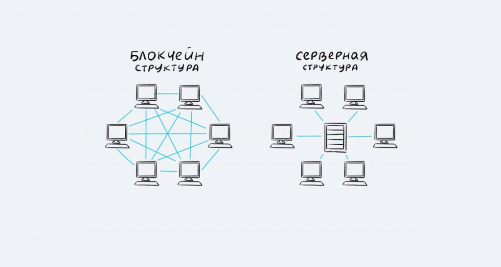
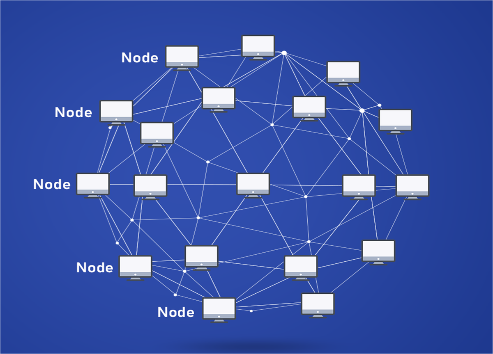
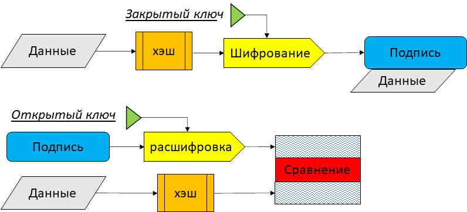
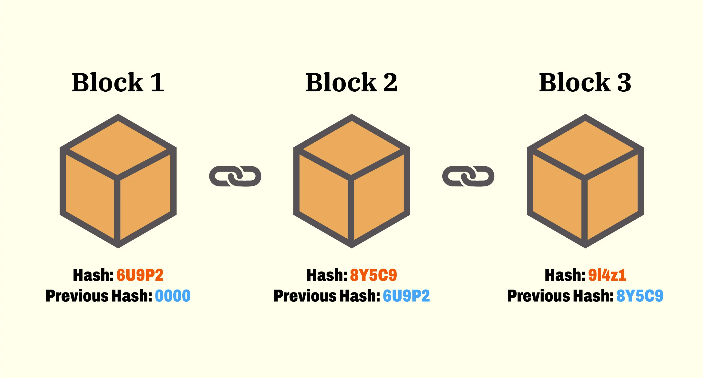
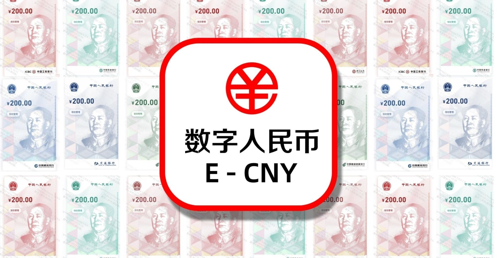
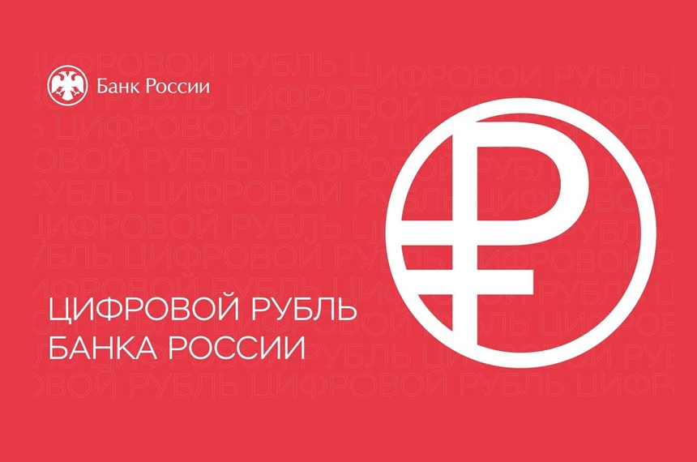
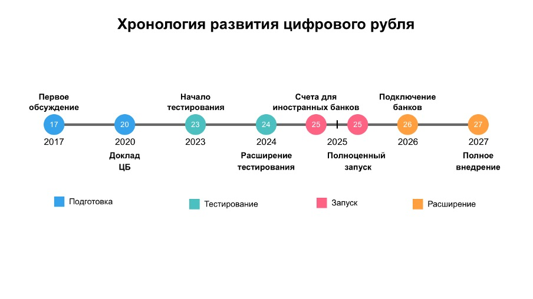

<h1 style="font-weight: 700"> Блокчейн </h1>

## 🤔Что такое Блокчейн простыми словами ##
Представьте себе большую цифровую книгу учета (бухгалтерскую книгу), которую ведут не в одной компании, а одновременно на тысячах компьютеров по всему миру. Это и есть блокчейн.

Простая аналогия: Если вы представите себе общий Google Документ, который каждый может **просматривать** и в который можно **добавлять** новые строки, но никто не может **изменить** или **удалить** уже существующие, то вы близки к пониманию.

В слове Blockchain два составляющих — *Block* (Блок) и *Chain* (Цепь). «Блок» — это запись о нескольких действиях (например, переводах денег). «Цепь» — это связь этих блоков между собой в хронологическом порядке. Каждый новый блок содержит «отпечаток» (хэш) предыдущего. Если кто-то попытается изменить информацию в старом блоке, это сразу станет заметно, так как нарушится вся цепочка. Это делает систему очень надежной и прозрачной.
!!! note
    Блокчейн — вид распределенного реестра, который представляет собой выстроенную по определенным правилам последовательную цепочку, которая формируется из блоков транзакций. При этом каждый последующий блок данной структуры содержит информацию о предыдущем блоке, таким образом, в целом цепочка хранит всю историю совершенных транзакций.

## 🌐Основной прицип блокчейна: Децентрализованность

Традиционные системы (как банк или государственный реестр) — централизованные. Есть один главный сервер или орган, который всем управляет и хранит все данные. Если его взломать, отключить или он выйдет из строя — вся система перестанет работать.

Блокчейн — децентрализованный. У этой цифровой книги нет одного хозяина. Ее полные копии хранятся и обновляются одновременно на тысячах независимых компьютеров по всему миру. Блокчейн сеть на основе архитектуры одноранговой P2P (Peer-to-Peer) сети, которая работает поверх TCP/IP.[6]

+ В клиент-серверной архитектуре (классический интернет): ваш браузер (клиент) обращается к серверу, чтобы получить информацию. Все завязано на одном центральном пункте.
+ В P2P-архитектуре все участники (узлы) равны и соединяются напрямую друг с другом. Нет главного сервера. Каждый узел одновременно является и клиентом, и сервером.

Преимущества архитектуры:

+ Устойчивость: Чтобы «сломать» сеть, нужно выключить все компьютеры одновременно, что невозможно.
+ Отсутствие единой точки отказа: Если один или даже несколько компьютеров выйдут из строя, сеть продолжит работу.
+ Прозрачность и доверие: Все видят все операции, и никто не может тайно их подделать. Доверие создается не посредником (банком), а математикой и криптографией.

## 👥Из кого состоит сеть блокчейна? (Ноды, Майнеры)

Главными участниками сети выступают ноды (пользователи). Нода — это любой компьютер, подключенный к блокчейн-сети. Это основа основ, инфраструктура, на которой всё держится. Они обеспечивают безопасность сети, проверяют подписи в транзакциях, убеждаются в отсутствии двойных трат, проверяют блоки и хранят историю транзакций(блокчейн).[6]

У нодов есть пара криптографических ключей: **Приватный ключ**(держится в секрете) и **Публичный ключ**(известен всем в сети, ваш идентификатор). С помощью Приватного ключа можно создавать цифровую подпись, которая подтверждает, что транзакция была отправлена именно владельцем.[5]

!!! note
    Криптографические ключи — это последовательность данных, используемая в криптографии для защиты информации: шифрования, расшифровки, проверки электронных подписей и аутентификации. Они являются основой кибербезопасности и обеспечивают конфиденциальность и целостность данных. Существуют два основных типа: симметричные (используют один ключ для шифрования и расшифровки) и асимметричные (используют пару открытого и закрытого ключей). Это фундаментальный механизм безопасности в блокчейне, который обеспечивает владение активами и защиту транзакций.

Как это работает в блокчейне:

+ Новый узел подключается к сети, находя хотя бы несколько других узлов.
+ Когда один узел создает или получает новую информацию (например, транзакцию или блок), он рассылает ее всем своим "соседям". Те, в свою очередь, рассылают ее своим соседям, и так информация распространяется по всей сети за секунды.
+ Если информацию, которую получает узел, неверная, то нод отвергает её и не рассылает дальше.

Виды нодов:

+ Полные ноды (Full Nodes): Хранят полную копию блокчейна от самого первого блока до текущего момента. Проверяют и валидируют каждый новый блок и все транзакции по строгим правилам консенсуса. Автономно верифицируют всю историю транзакций, не доверяя третьим сторонам.Распространяют информацию — ретранслируют валидные данные другим узлам
+ Легкие ноды(Light Nodes): Хранят только заголовки блоков (легковесная версия). Запрашивают информацию о конкретных транзакциях при необходимости. Идеальны для мобильных кошельков и приложений с ограниченными ресурсами
+ Майнеры/Валидаторы — это специализированные участники, которые создают новые блоки через процесс, называемый майнингом.

## 🔑Открытый и закрытый ключ
Открытый и закрытый ключ — это пара криптографических ключей, связанные асиметричным шифрованием.
!!! note
    Асимметричное шифрование — это метод шифрования данных, использующий пару математически связанных ключей: открытый (публичный) для шифрования и закрытый (приватный) для расшифровки.[5]
Приватный ключ представляет из себя 256-битное случайное число, отображается как 64-символьная строчка в шестнадцатеричной системе счисления. Пример: *E9873D79C6D87D...*

Публичный ключ генерируется из закрытого ключа через алгоритмы криптографии на эллиптических кривых (Elliptic Curve Digital Signature Algorithm). Каждому приватному ключу должен соответсвовать единственный публичный.[5]
!!! note
    Алгоритм ECDSA (Elliptic Curve Digital Signature Algorithm) — это реализация схемы цифровой подписи, основанная на использовании эллиптических кривых и модульной арифметики.
+ С помощью Приватного ключа можно создавать цифровую подпись, которая подтверждает, что транзакция была отправлена именно владельцем. 
+ С помощью Публичного ключа можно подтвердить подлинность подписи(проверить, что подпись была создана именно владельцем приватного ключа)

Как это работает:

!!! note
    Хеш (хеш-сумма) — это строка фиксированной длины, которая получается путем преобразования данных произвольного размера с помощью специальной хеш-функции. Этот процесс называется хешированием, а результат — это уникальный идентификатор, который используется для проверки целостности данных или в качестве ключа для поиска в хеш-таблицах. Хеш нельзя восстановить до исходных данных(хеш-функция необратима), а даже малейшее изменение входных данных приведет к совершенно новому хешу.
    В блокчейне используется хеш-функция SHA-256, то есть функция преобразуетв 256-битную строку.[3]

## ✅Как принимают новый блок? (Майнинг, Механизм Консенсуса)
В блокчейн каждый блок состоит из двух частей — **заголовка** и **списка транзакций**.

Заголовок состоит из[3]:

1. Хеша предыдущего блока.
2. Времени создания(временной метки).
3. Случайного числа Nonce.
4. Хеша всех транзакций(все транзакции попарно хешируются, пока не получится один единственный хеш).
5. Другие параметры: В зависимости от блокчейна, могут включаться дополнительные данные, например, сложность майнинга.
6. Хеш текущего блока(хеш всех остальных данных в заголовке(1-5) ).

Все блоки связаны в именно в цепочку, потому что каждый хеш нового блока = хеш-функция(хеш предыдущего блока). Блоки нельзя просто так переставить местами, так это нарушит их взаимосвязь через хеши.

Для того чтобы принять новый блок, независимым участники распределенной сети нужно договориться об едином состоянии данных, то есть прийти к общему согласию(консенсусу). Консенсус обеспечивает целостность и работоспособность сети блокчейн, помогает достичь согласия между ее участниками. В отличие от протокола, который устанавливает нормы обмена данными между участниками сети, механизм консенсуса определяет то, как они приходят к согласию по актуальному состоянию этих данных.

Механизм консенсуса в блокчейне необходим для защиты сети от конфликтов, двойных трат, а также других видов нарушений.

Механизмы консенсуса бывают различными, функционируют они на основе разных принципов. В Bitcoin таким является Proof of Work(Доказательство работы). В этом механизме майнеру, чтобы получить возможность сформировать блок, ему нужно провести определенную вычислительную работу.

Работой майнером является формирование блока(проверка на отсутствие двойных трат)подбор случайного числа Nonce, под условия сети. Майнеры подбирают число и вычисляют с ним хеш. Когда найдется майнер, который первый найдет правильное nonce, такое что хеш будет соответсвовать определенным условиям, то он сможет распространить его версию нового блока. Доказательством работы будет выступать nonce. В награду майнер получает все комиссии с тразакций, а также новые созданные монеты.[4]

## 🇷🇺Ситуация в России
Текущее состояние блокчейн-индустрии в России:
Российский подход к блокчейну можно охарактеризовать как прагматичный и осторожный, с акцентом на государственный контроль и суверенитет. Ситуация кардинально отличается как от либеральных подходов (как в ЕС или США), так и от запретительных (как в Китае, где запрещены криптовалюты, но не технологии).

!!! note
    CBDC (Central Bank Digital Currency) — это цифровая форма национальной валюты, выпускаемая центральным банком страны, представляющая собой цифровой аналог наличных денег, но существующий только в цифровом виде и контролируемый государством, что обеспечивает стабильность и безопасность, в отличие от децентрализованных криптовалют, и призванная сделать финансовые системы более эффективными и доступными.[7]

1. Нормативно-правовая база:
Криптовалюты: С 1 января 2021 года вступил в силу закон «О цифровых финансовых активах (ЦФА)». Он легализовал криптовалюты, но с серьёзными ограничениями: запрещено использование их в качестве средства платежа (за товары и услуги). Они рассматриваются как имущество. С 2024 года идут эксперименты по использованию цифровых валют в международных расчетах.
Майнинг: Признан предпринимательской деятельностью. В 2022 году был принят закон, легализующий майнинг и разрешающий продажу добытой криптовалюты за рубеж, но с обязательной идентификацией майнеров через гостреестр.
Цифровой рубль (CBDC): Банк России активно разрабатывает и тестирует цифровой рубль. Это приоритетный государственный блокчейн-проект. Пилоты с реальными операциями начались в 2023 году. Цель — создание контролируемой двухуровневой системы для расчетов, снижения издержек и повышения прозрачности.[7]

2. Сфера применения: 
Изначально интерес был к криптоактивам, но сейчас фокус сместился на корпоративные и государственные блокчейн-решения:
 Госсектор: Эксперименты с реестрами (например, ведение реестра прав на недвижимость, дипломов об образовании), цифровые паспорта товаров, прослеживаемость поставок.
Финансовый сектор: Банки используют блокчейн для торгового финансирования, KYC-процедур и внутренних расчетов (например, платформа «Мастерчейн» от Банка России и ведущих банков).
 Логистика и цепочки поставок: Крупные компании (Сбер, ВТБ, «Норникель» и др.) тестируют блокчейн для отслеживания товаров от производителя к потребителю.[8]

3. Сравнение с другими странами:
США: Подход децентрализован, регулирование зависит от штата. Активно развивается DeFi, NFT, институциональные инвестиции. Государственный блокчейн-проект (CBDC) находится на стадии обсуждения и вызывает много споров.
Китай: Полный запрет на криптовалюты и майнинг, но масштабное внедрение цифрового юаня (e-CNY) и поддержка блокчейна как технологии (BaaS-платформы) для бизнеса под строгим контролем государства. Россия близка к китайской модели в части контроля, но сохраняет «окно» для легального майнинга и владения криптоактивами.

## 🚀Перспективы развития

Перспективы в России есть, но они жёстко заданы рамками государственной стратегии[8]:

1. Доминирование цифрового рубля: Основные инвестиции и регуляторные усилия будут направлены на внедрение CBDC. Успех цифрового рубля станет ключевым индикатором развития всей экосистемы.[9]

2. Развитие «санкционных» и международных расчетов: Блокчейн-платформы рассматриваются как один из инструментов для организации расчётов со странами-партнёрами в обход традиционных финансовых систем (SWIFT). Это станет мощным драйвером для пилотных проектов.

3. Расширение корпоративных решений: Внедрение в логистике, энергетике (учёт и торговля углеродными единицами), госзакупках. Акцент на повышение доверия и снижение транзакционных издержек в изолированных системах.

4. Ужесточение контроля: Вероятно дальнейшее ужесточение требований к идентификации пользователей криптобирж, отслеживанию транзакций (соответствие рекомендациям FATF).

5. Риски для публичного блокчейна и DeFi: Инновации в сфере децентрализованных финансов (DeFi), NFT и публичных блокчейнах (Ethereum, Solana) будут тормозиться из-за регуляторной неопределённости и риска ограничений. Талантливые разработчики могут продолжать уезжать в более либеральные юрисдикции.

6. Российский бизнес и государственные структуры активно исследуют и внедряют блокчейн-решения для оптимизации процессов и повышения прозрачности:

    + СберБанк - разработал платформу «СберБлокчейн» на базе Hyperledger Fabric, использует для выпуска цифровых банковских гарантий и проведения сделок репо
    !!! note
        Hyperledger Fabric — это программный фреймворк для разработки приложений и специализированных бизнес-решений на основе блокчейна. 
    + Альфа-Банк - внедрял блокчейн для автоматизации процесса выдачи банковских гарантий, что ускоряет получение гарантий клиентами
    + ВТБ - проводил эксперименты с блокчейн-платформой для межбанковских расчетов и документарных операций
    + X5 Group («Пятерочка», «Перекресток») - использует блокчейн-платформу «Финтренд» для автоматизации финансирования поставок, позволяя поставщикам получать оплату сразу после приемки товара
    + «Вайлдберриз» - применяет блокчейн для защиты авторских прав брендов и борьбы с контрафактом через создание реестра подлинных товаров
    + Группа «М.Видео-Эльдорадо» - тестировала блокчейн для отслеживания цепочек поставок бытовой техники и электроники
    + Ростелеком - является ключевым оператором системы «Мастерчейн», российской блокчейн-платформы для создания доверенной цифровой подписи документов
    + Норникель - тестировал использование блокчейна для отслеживания происхождения металлов от добычи до поставки клиенту
    + РЖД - экспериментировала с блокчейном для цифровизации процессов грузоперевозок и товарно-транспортных документов
    + Росреестр - проводил эксперименты с блокчейном для регистрации сделок с недвижимостью, чтобы сделать процесс более прозрачным и безопасным
    + Минцифры России - разрабатывало концепцию использования блокчейна в системе госуправления, включая ведение реестров и документооборот
    + Московская биржа - исследовала возможности блокчейна для создания инфраструктуры цифровых финансовых активов

Вывод: Россия не стремится быть лидером в глобальной криптореволюции. Она создаёт замкнутую, контролируемую цифровую среду, где блокчейн-технологии служат, в первую очередь, целям государственного управления, финансового суверенитета и эффективности крупного бизнеса. Основная перспектива — во внутренней цифровизации и нишевых международных проектах с «дружественными» странами.

### Список источников 
1. О БЛОКЧЕЙН-ТЕХНОЛОГИИ/Исаева Д.Г.// <https://cyberleninka.ru/article/n/o-blokcheyn-tehnologii>
2. Введение в блокчейн 2.0/Жданов И.Н. Федоров А.И. Балашов А.В.//Текст научной статьи по специальности «Компьютерные и информационные науки»// <https://cyberleninka.ru/article/n/vvedenie-v-blokcheyn-2-0>
3. Технологии блокчейн: учебно-методическое пособие по дисциплине «Финансовые технологии»/Издательство
    Московский технический университет связи и информатики// <https://e.lanbook.com/book/478478>
4. Статья Binance Academy "Что такое алгоритм консенсуса блокчейна?" // <https://www.binance.com/ru/academy/articles/what-is-a-blockchain-consensus-algorithm>
5. Статья Binance Academy "Что такое цифровая подпись?" // <https://www.binance.com/ru/academy/articles/what-is-a-digital-signature>
6. Англоязычная статья ByBit Learn "Peer-to-Peer Blockchain Networks: The Rise of P2P Crypto Exchanges"//<https://learn.bybit.com/en/bybit-p2p-guide/peer-to-peer-blockchain-network>
7. ИССЛЕДОВАНИЕ И АНАЛИЗ ЦИФРОВЫХ ВАЛЮТ ЦЕНТРАЛЬНЫХ БАНКОВ (CBDC)//<https://cyberleninka.ru/article/n/issledovanie-i-analiz-tsifrovyh-valyut-tsentralnyh-bankov-cbdc>
8. Статья ItWeek "Перспективы блокчейн в России"//<https://www.itweek.ru/idea/article/detail.php?ID=182389>
9. Статья Росконгресс "Будущее денег: перейдет ли Россия на цифровой рубль в ближайшие годы?"//<https://roscongress.org/materials/budushchee-deneg-pereydet-li-rossiya-na-tsifrovoy-rubl-v-blizhayshie-gody/>
